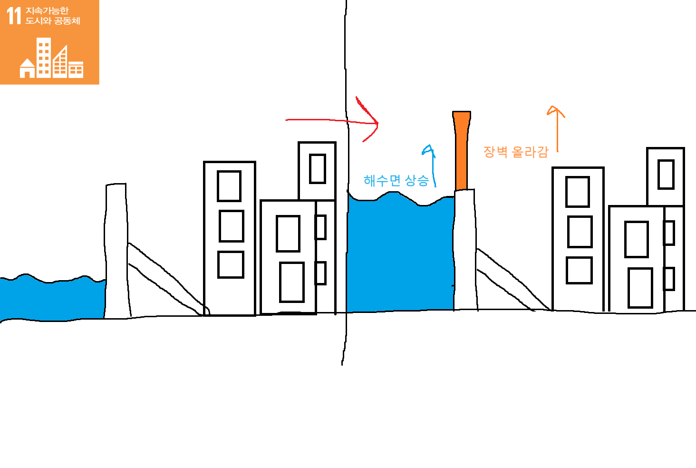
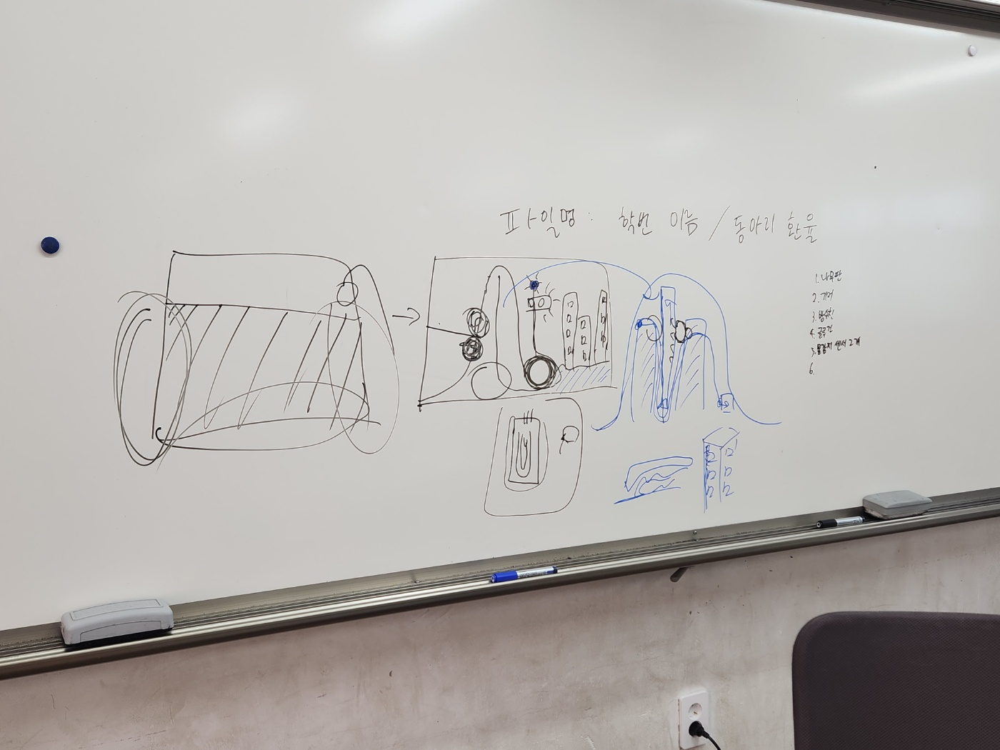
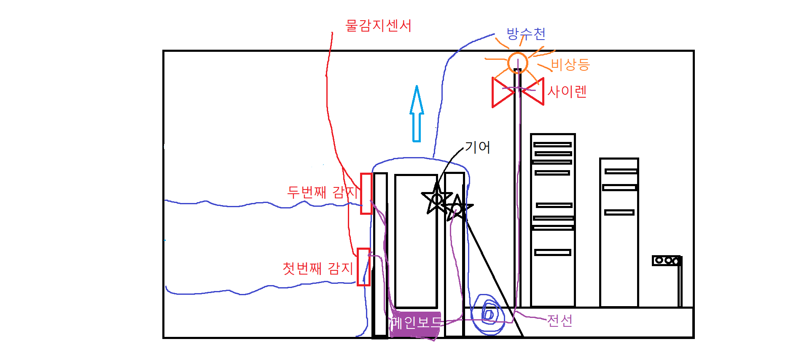
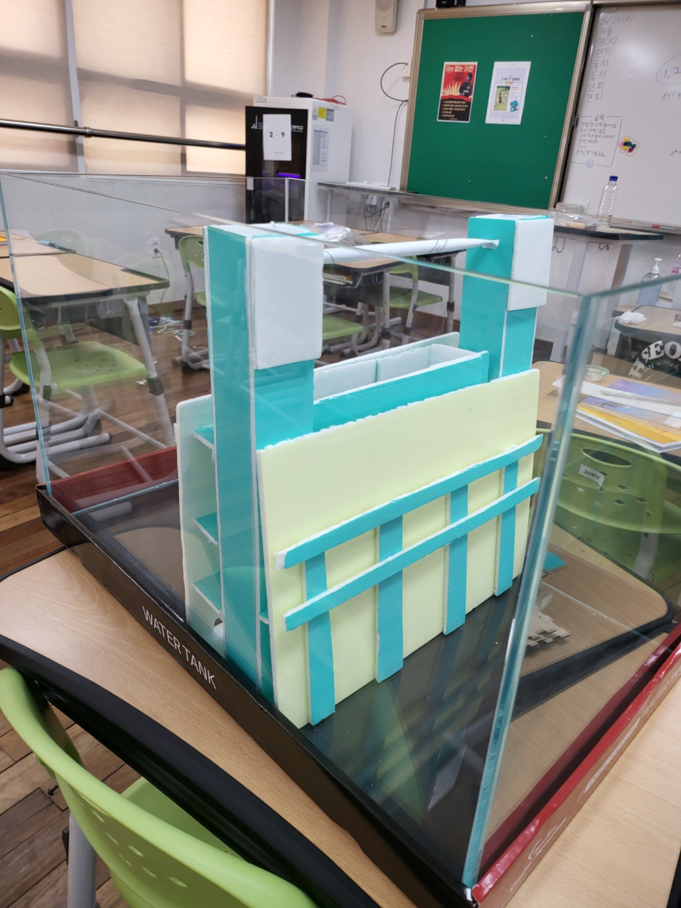
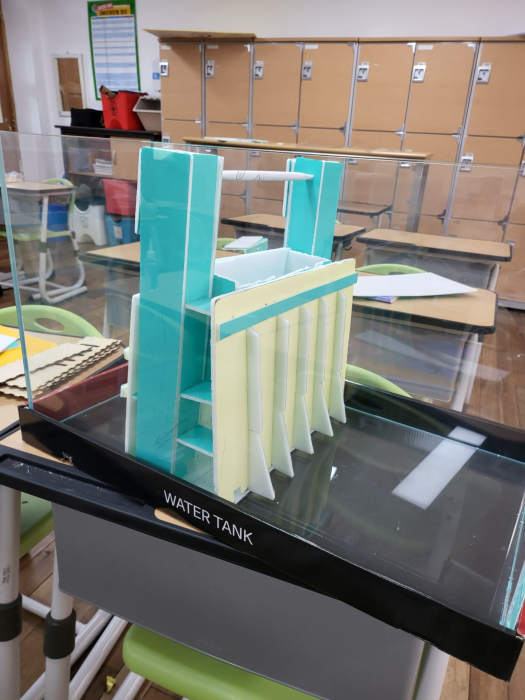
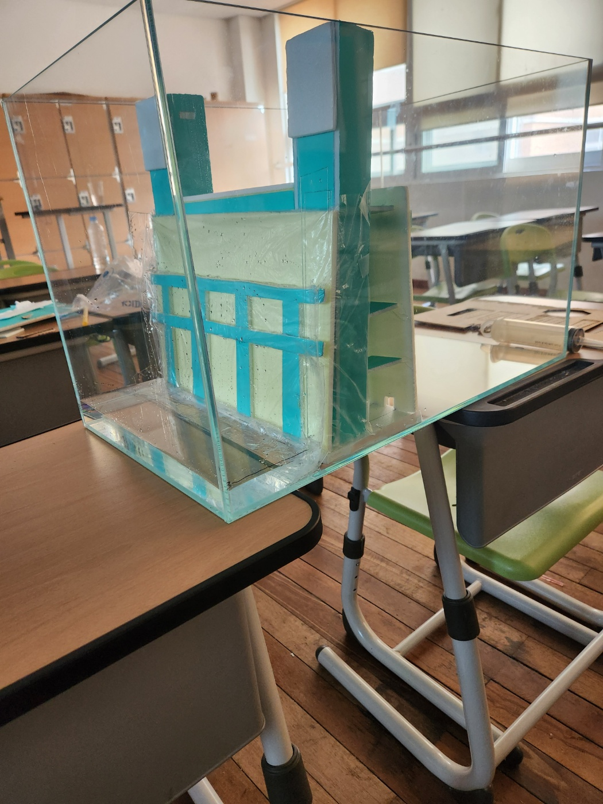

# Wall_Sina
> **2024 지속 가능한 발전_진규야 밥먹자 시즌 1**  
>
> 해수면 상승에 대비하는 해안 장벽  
>
> 네덜란드 홍수 조절 시스템 '델타웍스' 참고
> 
>

---
## 회로 연결도 (핀맵)

| 부품 (Component) | 아두이노 핀 (Arduino Pin) | 비고 (Note) |
| :--- | :---: | :--- |
| **Water Sensor** | A0 | Analog Input |
| **System Button** | 1 | Input Pull-up |
| **TM1637 CLK** | 2 | Display Clock |
| **TM1637 DIO** | 3 | Display Data |
| **Stepper Motor (IN1)** | 4 | 28BYJ-48 |
| **Stepper Motor (IN2)** | 6 | 28BYJ-48 |
| **Stepper Motor (IN3)** | 5 | 28BYJ-48 |
| **Stepper Motor (IN4)** | 7 | 28BYJ-48 |
| **Status LED (OFF)** | 8 | 시스템 꺼짐 표시 (Red) |
| **Status LED (ON)** | A1 | 시스템 켜짐 표시 (Green) |
| **Traffic Light (Red)** | A5 | 신호등 빨강 |
| **Traffic Light (Yel)** | A4 | 신호등 노랑 |
| **Traffic Light (Grn)** | A3 | 신호등 초록 |
| **Alert LED 1** | 11 | 보조 경고등 (Red) |
| **Alert LED 2** | 10 | 보조 경고등 (Blue) |
| **Buzzer** | 12 | 경고 부저 |
| **Laser Module** | 9 | 상시 작동 |

---

## 주요 기능

1.  **시스템 제어** : 버튼을 통해 전체 시스템의 ON/OFF를 제어하며, 상태 표시 LED로 현재 활성화 여부를 확인합니다.
2.  **자동 수위 감지** : 수분 센서를 통해 물이 감지되면 자동으로 경고 시퀀스가 시작됩니다.
3.  **단계별 경고 시스템 (물이 감지되었을 때 작동)** :
    * **초기 (0~27초)** : 녹색 신호, 모터 정회전, 부저 알림.
    * **주의 (27~47초)** : 황색 신호, 모터 정지.
    * **경고 (47~90초)** : 황색/적색 점멸 패턴 변경.
    * **위험/복구 (90~110초)** : 적색 신호, 모터 역회전.
  

